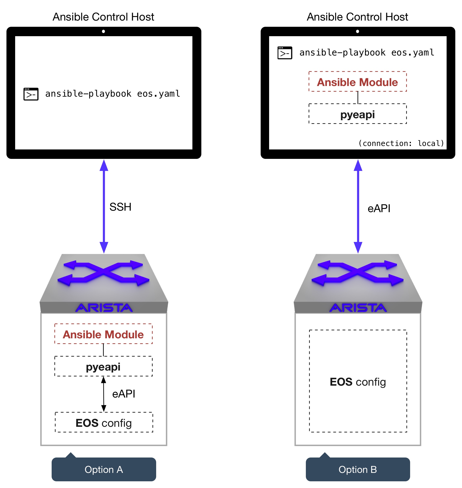

########
Overview
########

************
Introduction
************
Ansible is a configuration management framework that provides an automated
infrastructure for managing systems devices and applications. Ansible provides
this functionality using an agent-less approach that focuses on management of
the destination device and/or application over SSH. Ansible achieves its vision
through the implementation of playbooks and modules. Playbooks, which are in
turn comprised of a series of tasks to be executed on a host or group of
hosts, provide the fundamental workflow in Ansible. Modules are host and/or
application specific that perform the operations based on the directives of
the tasks and playbooks. Complete details about Ansible can be found in
their `documentation <http://docs.ansible.com/index.html>`_.

****************
Connection Types
****************
Ansible provides three distinctly different connection types each providing
a different method for connecting the Ansible runtime components
(playbooks, modules) with the destination device. A summary of the connection
types are below.

SSH Connection
==============
When operating in this mode, Ansible will connect to the destination host
using an encrypted SSH session. The SSH connection is established using
either the hosts native SSH binary or using the
`Paramiko <http://docs.ansible.com/intro_getting_started.html#remote-connection-information>`_
library. Since it uses SSH as the transport, the Ansible connection needs to
be able to authenticate to the remote system and expects to operate in a
Linux shell environment.

Local connections
=================
When a host or task is operating with a local connection, tasks are executed
from the Ansible host where the job was initiated. Local connections allow
Ansible to make use of API transports and remove the need for establishing an
SSH connection to the target device.

Accelerated mode
================
Ansible supported (since v0.8) a mode of operation known as Fireball mode.
Fireball mode has since been depreciated in favor of accelerated mode (as of v1.3).
Accelerated mode connects to the destination node and starts a daemon that is
used for the remainder of the transaction.

.. tip:: More details about `Accelerated Mode <https://docs.ansible.com/playbooks_acceleration.html>`_ from Ansible's documentation.

In addition to the connection types discussed above, Ansible also supports
a pull model. The pull model works in conjunction with SCM systems to perform
its duties locally on the node. The pull model executes a local utility that
retrieves the configuration data and proceeds to execute all of the activity
locally on the node.

.. _ansible-eos-role-label:

********************
The Ansible EOS Role
********************

Integration with the Python Client for eAPI
===========================================
The Ansible Role for EOS builds on the `Python Client for eAPI <https://github.com/arista-eosplus/pyeapi>`_ to provide
automation of the management plane.  Using eAPI as the underlying tranport,
Ansible can be configured to interface with Arista EOS using either SSH based
connections or HTTP based connections.

.. _deployment-topologies-label:

Topologies
==========
Above, we discussed how Ansible is typically used to control a node. These
principles remain true for Arista EOS nodes, however, there are some nuances
that are important to understand when using the Ansible EOS role. Next, we will discuss the two main
methods used to control an Arista EOS node using Ansible.

The illustration above demonstrates a typical scenario. You, as the user, want
to execute an Ansible Playbook on one (or many) of your Arista nodes. From the
user's perspective the interaction with the Ansible Control Host is the same,
from your shell you would type:

.. code-block:: console

  ansible-playbook eos.yaml

Notice in the diagram a few things remain constant:

* pyeapi is always required (whether on the control host or EOS node), and
* pyeapi is ultimately responsible for making the eAPI calls to modify the node's configuration

While the overall flow is similar, the way in which the playbook is executed
will differ between Option A and Option B. Let's discuss those differences below.

Option A
========
This method follows the traditional Ansible control procedure, namely:

1. Execute ``ansible-playbook eos.yaml`` from the Ansible Control Host
2. Collect Fact information from the node
3. Download the module to the node
4. Execute the module on the node
5. pyeapi commands run locally to modify configuration
6. Read stdout and parse it into JSON
7. Return the result to the Ansible Control Host

**Assumption 1**
You'll notice that this method uses SSH to communicate with the node. This
implies that you have already included the Ansible Control Host's public SSH
key in the nodes ``authorized_keys`` file, or you are providing a password
when the playbook executes.

**Assumption 2**
Pyeapi is used by the Ansible EOS role modules to make configuration changes on the
node. This implies that ``pyeapi`` is already installed on the node. The pyeapi
module is NOT installed on Arista EOS nodes by default, so installation would
be required by the user.

.. _security-model-label:

Understanding the Security Model
--------------------------------

The Ansible EOS role provides a two stage authentication model to
maximize the security and flexibility available for providing programatic
access to EOS nodes.   The steps above walk through how to enable both eAPI
and create a shell account for use with Ansible.   This section provides some
additional details about how the two stage authentication model works.

.. Note:: The two stage authentication model only applies to Option A.

Implementing a two stage security model allows operators to secure the
Ansible shell account and prevent it from configuring EOS.  Conversely, having
a separate eAPI authentication mechanism allows operators to separately
control the users that can run EOS modules without giving them root
access to EOS.

When Ansible connects to an EOS node, it must first authenticate to Linux
as it would for any other Linux platform.  In order to create the shell
account, the steps in :ref:`A-eos-user-label` should be followed.  The
steps above will create a user called 'ansible'.  You are free to choose
any username you like with the following exception: you cannot create a
username the same as a local account in EOS (more on that in a moment).

By default, the EOS role assumes the user account is called 'ansible'.  If
the shell account is different, then the eos_username variable must be set
in your playbook to the name of the shell account you intend to use.  This
ensures that the EOS node is bootstrapped properly for use with Ansible.

The second stage authentication model uses eAPI.  eAPI provides its own
authentication mechanism for securing what users can perform which actions
in EOS. The eAPI user can be one that is authenticated by AAA; however,
that is outside the scope of this discussion.  The section :ref:`A-enable-eapi-label`
provides an example of how to create a local user to use when
authenticating with eAPI.

.. Note:: The shell account and eAPI user must be different.

Ansible Host file and eapi.conf for Option A
--------------------------------------------

It is important to understand that pyeapi is ultimately responsible for sending
the configuration commands to your node. This means that at some point your
adhoc command or playbook needs to indicate the credentials to create an eAPI
connection. There are a few different ways to do this as explained below.

Method 1: Using Meta Arguments
^^^^^^^^^^^^^^^^^^^^^^^^^^^^^^

Meta arguments are used to pass the exact eAPI connection parameters during adhoc
command or play. If you provide all of the required eAPI connection information
you will not even need to use eapi.conf. This is the preferred method since you
do not need to create/maintain an eapi.conf file on the EOS node.

.. tip:: Read all about :ref:`meta-args-label`

**Example:** In a playbook

**eos-playbook.yml** on Control Host

.. code-block:: yaml

  - name: eos nodes
    hosts: eos_switches

    tasks:
    - name: Configure EOS VLAN resources
      eos_vlan: vlanid=100
                name=mynewamazingvlan100
                username={{ username }}
                password={{ password }}
                transport={{ transport }}

**/etc/ansible/hosts** on Control Host

.. code-block:: console

    [eos_switches]
    192.168.0.50
    192.168.0.51
    192.168.0.52
    192.168.0.53

    [eos_switches:vars]
    ansible_ssh_user=ansible
    # Used for eapi connection once SSH'd in
    username=eapi
    password=password
    transport=https

**/mnt/flash/eapi.conf** on EOS node

.. code-block:: console

    # empty file. This file is not needed on the EOS device.

**Explanation**

This method utilizes the Ansible hosts file to feed information into the playbook.
We group our nodes under the ``eos_switches`` group name to avoid duplication of
variables, and use ``[eos_switches:vars]`` to create a set of variables that apply to all
switches in the group. These variables are available in the playbook.
We indicate in the play to execute our task against all nodes in this group. Then
We use ``{{ username }}``, ``{{ password }}`` etc. to substitute the
eapi parameters into the play.
Since all of the necessary eAPI information is present, the module does not
need to consult an eapi.conf on the EOS node for connection parameters. In effect,
the simplified connection flow looks like:

1. SSH to node in ``[eos_switches]`` (IPs 192.168.0.50-53)
2. Copy module(s) to EOS node.
3. Create eapi connection to ``http://localhost:80/command-api``
4. Modify node configuration.

Method 2: Using eapi.conf
^^^^^^^^^^^^^^^^^^^^^^^^^

In this method we will put all of the eAPI connection info into ``/mnt/flash/eapi.conf``
on each EOS node that is being controlled. When we execute a play or adhoc
command, pyeapi will not be passed connection information
from Ansible, therefore it will consult eapi.conf on the EOS node to learn eapi
connection information. As you can imagine this causes creates additional administrative
overhead and is not the most efficient method (ie try to use Method 1).

**Example**

**eos-playbook.yml** on Control Host

.. code-block:: yaml

  - name: eos nodes
    hosts: eos_switches

    tasks:
    - name: Configure EOS VLAN resources
      eos_vlan: vlanid=100
                name=mynewamazingvlan100
                connection={{ connection }}

**/etc/ansible/hosts** on Control Host

.. code-block:: console

    [eos_switches]
    spine-1
    spine-2
    tor-1
    tor-2

    [eos_switches:vars]
    connection=localhost
    ansible_ssh_user=ansible

**/mnt/flash/eapi.conf** on EOS node

.. code-block:: console

    [connection:localhost]
    username: admin
    password: password
    transport: https

**Explanation**

Here we use the ``connection`` meta argument. This directly relates the
connection name in eapi.conf. As you can see there is no eAPI connection information
in /etc/ansible/hosts, rather we just have names of nodes. This changes the
connection flow in the following way:

1. Control Host SSH into node listed in hosts file. EG ssh into spine-1 with user ansible
2. Copy modules to EOS node.
3. Execute module. The module is told to use ``connection=localhost``.
4. Module looks for ``localhost`` in ``/mnt/flash/eapi.conf``.
5. Learns which transport, username and password to use. Sets up eapi connection.
6. Executes commands to modify node configuration.

Option B
========
This method uses the ``connection: local`` feature within the ``eos.yaml``
playbook. This causes the transport method to be an eAPI connection (HTTP[S])
versus SSH. This changes how the playbook gets executed in the following way:

1. Include ``connection: local`` in ``eos.yaml``
2. Execute ``ansible-playbook eos.yaml`` from the Ansible Control Host
3. pyeapi consults the local ~/.eapi.conf file which provides node connection information
4. Collect Fact information from the node
5. Execute the module on the Ansible Control Host
6. pyeapi commands run over the network to modify configuration
7. Read stdout and parse it into JSON
8. Present the result on the Ansible Control Host

**Assumption 1**
Here, the connection between the Ansible Control Host and the Arista node is
an eAPI connection. This implies that you have an ``eapi.conf`` file on your
Ansible Control Host that contains the connection parameters for this node, or
you pass the connection parameters as meta arguments.
The caveat when using ``eapi.conf`` is that the password for the eAPI
connection is stored as plaintext. See :ref:`faq-security-label` for more information.

Ansible Host file and eapi.conf for Option B
--------------------------------------------

Regardless of the method you use to communicate with your node, one thing is constant:
pyeapi is ultimately responsible for sending the configuration commands to your node.
This means that at some point your adhoc command or playbook
needs to indicate the credentials to create an eAPI connection. There are a few
different ways to do this as explained below.

Method 1: Using Meta Arguments
^^^^^^^^^^^^^^^^^^^^^^^^^^^^^^

Meta arguments are used to pass the exact eAPI connection parameters during adhoc
command or play. If you provide all of the required eAPI connection information
you will not even need to use eapi.conf. This is the most verbose and least flexible.

.. tip:: Read all about :ref:`meta-args-label`

**Example:** In a playbook

**eos-playbook.yml** on Control Host

.. code-block:: yaml

  - name: eos nodes
    hosts: eos_switches
    connection: local

    tasks:
    - name: Configure EOS VLAN resources
      eos_vlan: vlanid=100
                name=mynewamazingvlan100
                host={{ inventory_hostname }}
                username={{ username }}
                password={{ password }}
                transport={{ transport }}

**/etc/ansible/hosts** on Control Host

.. code-block:: console

    [eos_switches]
    192.168.0.50
    192.168.0.51
    192.168.0.52
    192.168.0.53

    [eos_switches:vars]
    username=eapi
    password=password
    transport=https

**~/.eapi.conf** on Control Host

.. code-block:: console

    # empty file

**Explanation**

This method utilizes the Ansible hosts file to feed information into the playbook.
The key to success here is grouping our nodes under the ``eos_switches`` group name.
We then use ``[eos_switches:vars]`` to create a set of variables that apply to all
switches in the group. These variables are available in the playbook.
We indicate in the play to execute our task against all nodes in this group. Then
we use ``{{ inventory_hostname }}``, ``{{ username }}``, etc. to substitute the
host name (ip address in this case) and other connection parameters into the play.
Since all of the necessary eAPI information is present, the module does not
need to consult an eapi.conf file for connection parameters.

Method 2: Using eapi.conf
^^^^^^^^^^^^^^^^^^^^^^^^^

In this method we will put all of the eAPI connection info into eapi.conf. When
we execute a play or adhoc command, pyeapi will not be passed connection information
from Ansible, therefore it will consult eapi.conf to learn connection information.

**Example**

**eos-playbook.yml** on Control Host

.. code-block:: yaml

  - name: eos nodes
    hosts: eos_switches
    connection: local

    tasks:
    - name: Configure EOS VLAN resources
      eos_vlan: vlanid=100
                name=mynewamazingvlan100
                connection={{ inventory_hostname }}

**/etc/ansible/hosts** on Control Host

.. code-block:: console

    [eos_switches]
    spine-1
    spine-2
    tor-1
    tor-2

**~/.eapi.conf** on Control Host

.. code-block:: console

    [connection:spine-1]
    host: 192.168.0.50
    username: admin
    password: password
    transport: https

    [connection:spine-2]
    host: 192.168.0.51
    username: admin
    password: password
    transport: https

    [connection:tor-1]
    host: 192.168.0.52
    username: admin
    password: password
    transport: https

    [connection:tor-2]
    host: 192.168.0.53
    username: admin
    password: password
    transport: https

**Explanation**

Here we use a new meta argument ``connection``. This directly relates the
connection name in eapi.conf. As you can see there is no eAPI connection information
in /etc/ansible/hosts, rather we just have names of nodes. When the particular
ansible-eos module executes it will reference ``~/.eapi.conf`` to determine
how to connect to the EOS node over eAPI.

*************
Ansible Tower
*************
Ansible provides a product that implements a web based interface and REST API
known as `Tower <http://www.ansible.com/tower>`_. The web interface provides
some additional capabilities to the base Ansible framework around role based
access and programmatic interface to the Ansible environment.
